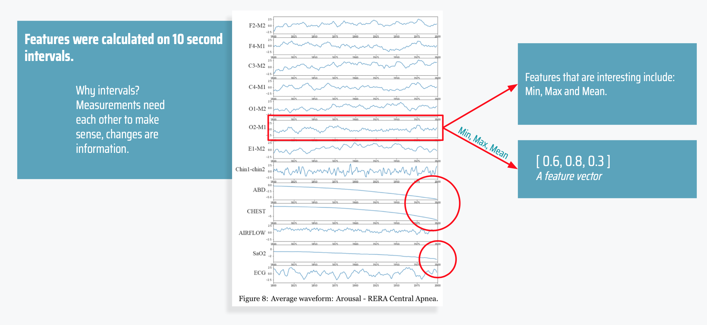

### Thesis project Anton Ivarsson & Jacob Stachowicz 2019 Computer Science KTH Royal Institute of Technology

Working with polysomnography data provided by physioNet data repository, to find abnormalities in sleep using machine learning. 

##### **Abstract:**

Sleep arousal is a phenomenon that affects the sleep of a large amount of people. 
The process of predicting and classifying arousal events is done manually with the aid of certified technologists, although some research has been done on automation using Artificial Neural Networks (ANN). This study explored how a Support Vector Machine performed(SVM) compared to an ANN on this task. Polysomnography (PSG) is a sort of sleep study which produces the data that is used in classifying sleep disorders. The PSG-data used in this thesis consists of 13 wave forms sampled at or resampled at 200Hz. There were samples from 994 patients totalling approximately 6.98 1010 data points, processing this amount of data is time consuming and presents a challenge. 2000 points of each signal was used in the construction of the data set used for the models. Extracted features included: Median, Max, Min, Skewness, Kurtosis, Power of EEG-band frequencies and more. Recursive feature elimination was used in order to select the best amount of extracted features. The extracted data set was used to train two ”out of the box” classifiers and due to memory issues the testing had to be split in four batches. When taking the mean of the four tests, the SVM scored ROC AUC of 0,575 and the ANN 0.569 respectively. As the difference in the two results was very modest it was not possible to conclude that either model was better suited for the task at hand. It could however be concluded that SVM can perform as well as ANN on PSG-data. More work has to be done on feature extraction, feature selection and the tuning of the models for PSG-data to conclude anything else. Future thesis work could include research questions as ”Which features performs best for a SVM in the prediction of Sleep arousals on PSG-data” or ”What feature selection technique performs best for a SVM in the prediction of Sleep arousals on PSG-data”, etc.

[Link to the full paper](http://kth.diva-portal.org/smash/record.jsf?pid=diva2%3A1354207&dswid=-1498)

### The Project in short:

#### Introduction

Poor sleep quality can cause health issues. Diagnosing sleep illnesses is done by classifying sleep abnormalities. A clinical term for sleep abnormality  is *Sleep Arousal.*

#### Problem formulation

***“*** Can a ***support vector machine*** perform better than 
   an ***artificial neural network*** on Polysomnography data 
   for ***classifying Sleep Arousals ? ”***

The type of data used to classify sleep arousals is derived from a sort of sleep study called polysomnography. The data derived consists of a variety of different physiological signals including: EEG (brain activity), EOG (eye movements), EMG (heart activity).

Above is a sample of the PSG data used in our project, to illustrate what the data looks like. 

This is an annotated arousal  of type respiratory effort related arousal which means it has to do with breathing. We can see how the stomach and chest retracts and how the saturation of oxygen in the breath lowers. This is what we our trying to find. Some patterns are hard to see even for sleep technicians. 

The data used in this project was taken from a repository of Physiological data called *PhysioNet*. It was contributed by the *Massachusetts General Hospital.* The data had been annotated by medical professionals, there were a total of 13 different types of arousals but our project was  limited to binary classification. Arousal or not Arousal. 

First we had perform some analysis on the data and figure out what features to train our model on. 
After this we implemented features selection, then trained and tested our models. 

**Normalization of the data.**
The first thing that we had to do was to normalize the data. 

The process of normalization puts all signals on the same interval, this is important to be able compare signals to each other because they scale the same.

 

It was significant that these signals had lowered at the end. A single measurement if a signal does not contain a lot of information, it is important to look at values before and after a measurement.

**Analysis - Covariance Matrix** 
To analyze the data we calculated average waveforms for each of the 13 types of arousals. 

*That is : we calculated what arousal of type X looks like on average, 10 seconds before.*

For each of these 13 average waveforms we calculated covariance matrices, to see how the signals interact before the events. A covariance matrix is a matrix that shows how different data samples correlate with each other. For example column i, row j shows how much signal i and j correlate with each other. Here we can see that signal 11 is highly correlated with signal 9. We concluded that this matrices had value and was going to be used later on.

**Extracting Features**
As mentioned earlier we extracted features from an interval of 10 seconds each that is a matrix of 2000x13 was used to calculate a data point. Features used where different statistical measures like, mean, max ,min etc. Distances between the current intervals covariance matrix to all the covariance matrices we just mentioned.  We also used features derived from the fourier transform of the interval, which is a technique for analysing the different underlying frequencies of an irregular signal.

We used **Recursive feature elimination** as our tool for selecting the best features. It  is a technique for selecting a number of features by recursively considering smaller and smaller sets of features.  We tested different numbers of selected features to come up with the optimal amount. 

**The machine learning models**
*ANN:*

- For those who do not know Artificial Neural network (ANN) is a group name for several machine learning methods which all use neural networks for binary and non-binary classification. 
- it is inspired of hom the brain works, a network of neurons
- is made up by a large amount of connections between different neurons which contain different weighted values. 
- The ANN model is used when a non-linear correlation exists between the input vector and the output.

*SVM:*

- Support Vector Machine (SVM) is a machine learning technique that is used for binary discriminative classification. 
- The SVM uses a decision boundary to separate data points between classes.

**Class balancing**
In the extracted data set data ratio between arousals vs non-arousal was 1 to 22. this is as you see very unbalanced.  Training the models on this imbalanced data yielded models that could not classify a single arousal correctly. We implemented a balancing algorithm resulting in a ratio of 1:2. 
This method is called undersampling. 

**Results and evaluation**
Simply using a percentage is not a good measure of accuracy in a situation like this, the classes are very imbalanced meaning that one class is more prominent. 21/22  ≈ 95% approx of the samples are NON arousal this means that guessing 0 on all  samples would yield an accuracy percentage of 95% but the actual predictive power would be terrible. AUC ROC weighs true positives against true negatives.

### **Conclusion**

We found that we had a bias towards SVM,  We used RFE to find the best amount of features for SVM, but not the ANN, due to limited time. However the ANN was forced to work with the same amount of features. This bias and the marginal difference between ANN and SVM makes the results inconclusive.

This project is inconclusive in its present state, mostly due to time constraints, but it has made a good stating foundation for future work and testing. The areas for further research and improvements are preprocessing, feature extraction, feature selection och improvements by tuning the classification models after the type of the data set.

### Future Improvements

There are a lot of areas to improve in. Below follows some suggestions:

- **Preprocessing**
  Improving computational time and potentially reducing noice
  Possible classification gain by down sampling the frequencies in the signals, e.g. from 200 hz to 100 hz or 50 hz, for reducing noise.
- **Feature extraction**
  Other features could be extracted, that could potentially be better than the existing features. 
- **Tuning the models.**
  We have only tested the models without tuning them independently for this specific task. Tuning the two classifiers would show which classifier is best, the untuned results does not. 
- **Feature selection methods.**
  We used a questionable method for finding the best features, a feature selection method that is optimized for linear regression. A suggestion for future work is to test different feature selection methods, e.g. *selectKbest* from the python library sklearn or other that are specifically 
- **K-Cross validation**
  Implementating K-cross validation for a better calibration of the models.
- **Better balancing**
- **Evaluation methods**
  We used AUC ROC in this project to measure performance. All the projects who participated in the Physionet challenge where evaluated using *The Area Under Precision-Recall Curve* (AUPRC). To compare the results an AUPRC evaluation method would would enable a possibility for comparison.
- **More memory**
  The limitations in not meeting the memory requirements made it impossible to perform training and testing on the whole data set. Our calculations show that we needed at least 41 GB of RAM. A alternative to acquiring more RAM is to down sample the data, this in turn could affect the classification accuracy

### Installing needed packages for the usage of extraction

* Install anaconda if not installed already
* conda install -c conda-forge hdf5storage
* If you can't find conda add the path variable by running: export PATH=~/anaconda3/bin:$PATH